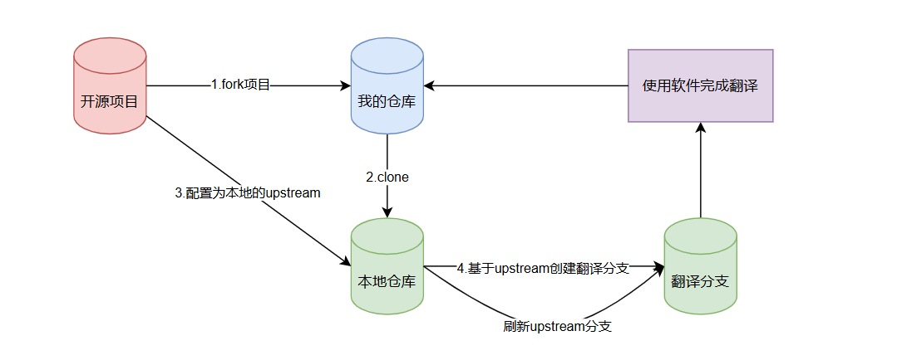

# OpenDocTranslator —— 让语言不再成为学习开源项目的壁垒

[](https://github.com/YOUR_REPO/open-doc-translator)
[](https://github.com/YOUR_REPO/open-doc-translator)
[](https://github.com/YOUR_REPO/open-doc-translator/blob/main/LICENSE)
[](https://github.com/YOUR_REPO/open-doc-translator/pulls)

---

## 😫 还在为啃英文文档而焦头烂额？


> *   **🐢 追赶不及的官方文档**：核心技术文档只有英文版，阅读效率低下，核心概念难以快速掌握。
> *   **⏳ 滞后的社区翻译**：关键更新和重要修复的中文说明遥遥无期，错过最新进展。
> *   **⚠️ 过时文档的陷阱**：盲目跟随旧版中文教程，踩坑无数，时间白白浪费。

本项目旨在解决这些问题：

1. **🛠️ 开源文档翻译工具**：结合 Git 版本控制与 AI 翻译，构建快速、自动化的文档翻译流程，减少人工重复工作。
2. **📋 开源文档翻译维护计划**：系统性地维护和更新一些常用的开源项目文档，确保翻译质量与时效性。

---

## ✅ 当前维护的文档项目


| 项目 | 描述 | 中文站点 |
|---|---|---|
| LangGraph | 有状态代理的低级编排框架 | [woniu9524.github.io/langgraph](https://woniu9524.github.io/langgraph ) |
| LangChain | LLM 应用开发框架 | [woniu9524.github.io/langchain](https://woniu9524.github.io/langchain ) |
| Agno | 多代理系统框架 | [ikun.mintlify.app/introduction](https://ikun.mintlify.app/introduction ) |

---

## ✨ 核心功能

### 🛠️ 翻译工具功能
*   **🗂️ 多项目管理**：在一个界面中轻松管理和切换多个 Git 翻译项目。
*   **🤖 变更自动追踪**：基于 Git Blob Hash 精确追踪上游文件变更，绝不遗漏任何更新。
*   **🚀 批量 AI 翻译**：集成您自己的 LLM API，一键批量翻译所有"未翻译"或"已过时"的文档。
*   **🖥️ 集成化 GUI**：在清晰的图形界面中完成状态监控、版本比对和人工校对，告别繁琐的命令行。
*   **🔄 深度 Git 集成**：内置 Git 工作流，从 `fetch` 上游变更到 `commit` 和 `push` 译文，一气呵成。
*   **🎯 精准状态管理**：通过 `translation_state.json` 文件，对每个文件的翻译状态（`未翻译`、`已过时`、`已翻译`）了如指掌。


---

## 🚀 快速上手

### 📋 操作流程图




### 前期准备：配置你的 Git 环境
在开始前，请确保你的本地 Git 环境已准备就绪。

1.  **Fork 仓库**： 在 GitHub 等平台，Fork 您想翻译的目标项目到自己的账户下。
2.  **克隆到本地**：
    ```bash
    git clone <你的 Fork 仓库 URL>
    ```
3.  **进入目录**：
    ```bash
    cd <项目目录>
    ```
4.  **添加上游仓库**：
    ```bash
    git remote add upstream <上游官方仓库 URL>
    ```
5.  **拉取分支**
    ```bash
    git fetch upstream
    ```
6.  **创建翻译分支**：
    ```bash
    git checkout -b translation-zh # 或其他你喜欢的分支名
    ```

### 开始使用：三步完成翻译

1.  **添加项目**：
    *   打开 `OpenDocTranslator` 客户端。
    *   点击主界面的 **“添加项目 (Add Project)”** 按钮。
    *   选择您刚刚配置好的本地项目根目录。
    *   选择正确的远程分支和翻译分支

2.  **配置与翻译**：
    *   从项目下拉框中选择您的项目。
    *   在 **“设置 (Settings)”** 面板中，配置您的 LLM API Key 和模型参数和一些筛选配置。
    *   点击 **“批量翻译 (Batch Translate)”**，让 AI 完成翻译工作。

3.  **提交与推送**：
    *   翻译完成后，您可以在界面中直接校对和修改。
    *   前往 **“Git”** 面板，`Commit` 并 `Push` 您的成果！

---

## ⚙️ 工作原理：基于 Git 的精准追踪

本工具的核心是 **基于 Git Blob Hash 的内容状态追踪**。

当您刷新项目时，工具会：
1.  获取 **上游源分支** 中每个文件的唯一内容哈希值 (`source_hash`)。
2.  将这个 `source_hash` 与当前分支的状态文件 (`{branch}-translation_state.json`) 中记录的哈希值进行比对。
3.  根据比对结果，判定每个文件的状态：
    *   `未翻译 (Untranslated)`: 状态文件中不存在该文件的记录。
    *   `已过时 (Outdated)`: 状态文件中有记录，但 `source_hash` 与上游不一致，表示原文已更新。
    *   `已翻译 (Up-to-date)`: 状态文件中有记录，且 `source_hash` 与上游完全一致。

---
